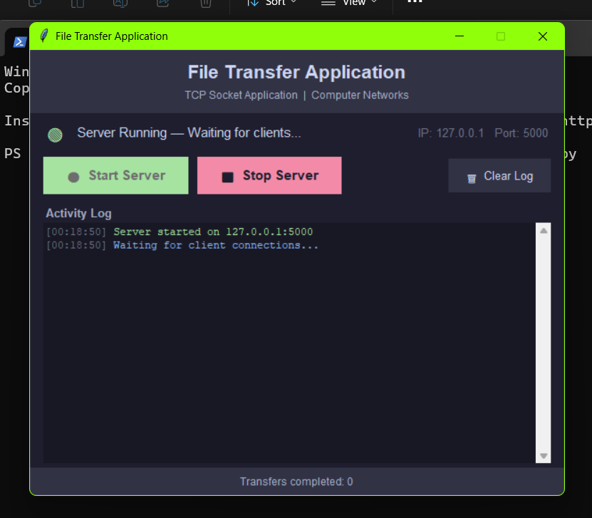
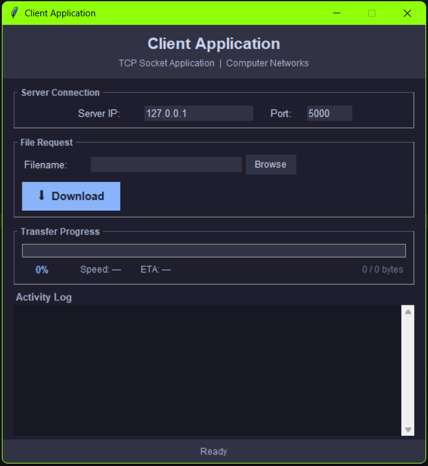
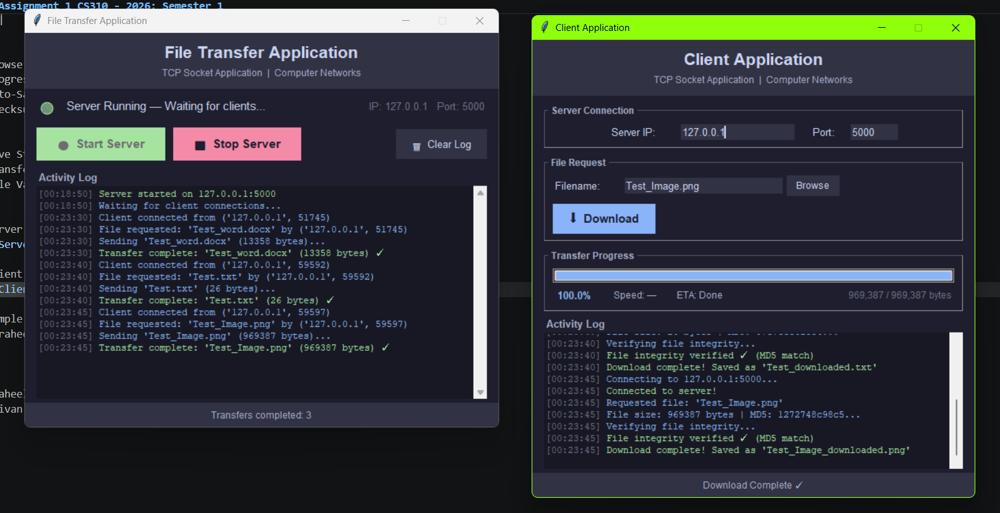
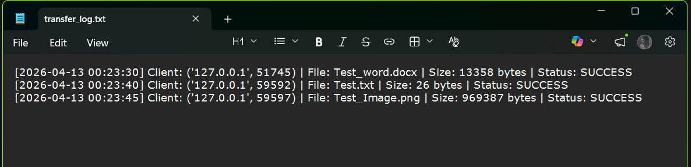
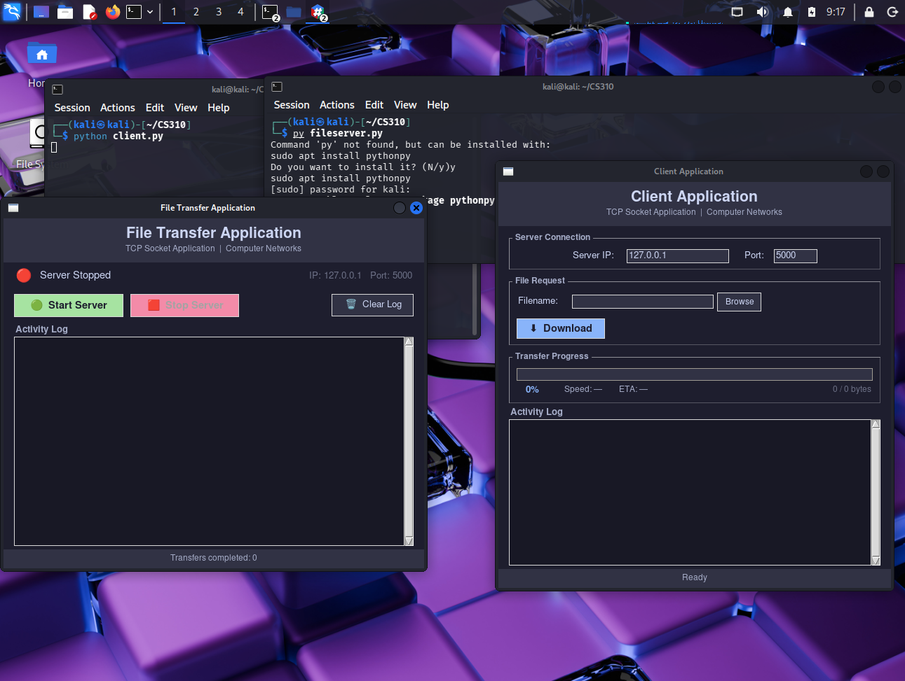

- [Assignment 1 CS310 - 2026: Semester 1](#assignment-1-cs310---2026-semester-1)
  - [Author](#author)
  - [Idea:](#idea)
  - [Pre-requisites](#pre-requisites)
  - [Project structure](#project-structure)
  - [How to run](#how-to-run)
    - [1. Prepare test files](#1-prepare-test-files)
    - [2. Start the server](#2-start-the-server)
    - [Start the client (Open a new terminal)](#start-the-client-open-a-new-terminal)
  - [Features](#features)
    - [Client features](#client-features)
    - [Server features](#server-features)
    - [Example usage](#example-usage)

# Assignment 1 CS310 - 2026: Semester 1

##       Author
Praheel Kumar - S11229535
Shivan Prasad - S11231502

## Idea:
A TCP-based file transfer system built using python for A1. It features a Tkinter GUI for both the client and server, includes real-time progress tracking, MD5 integrity verification, and detailed activity logging.

##        Pre-requisites
Python 3.8+
No external dependencies, uses only standard library

##        Project structure
├── client.py          # GUI File Transfer Client
├── fileserver.py      # GUI File Transfer Server
├── Test.txt           # This file is for test purposes
├── Test_word.docx     # This file is for test purposes
├── README.md          # This file
├── Images             # This folder contains images
└── transfer_log.txt   # Auto-generated transfer log (created on first use)

##      How to run
###     1. Prepare test files 
Place any file (txt, doc, img) in the same folder as fileserver.py

###     2. Start the server
Type python fileserver.py or py fileserver.py in the terminal
server listens on 127.0.0.1:5000
Place any files you want to serve in the same directory
GUI shows real-time connections and transfer status

###    Start the client (Open a new terminal)
Type python client.py or py client.py in the terminal
IP address 127.0.0.1 and port 5000 is entered by default (is set as default).
Browse or type a filename from the server directory
Click Download 

        How it Functions
Client                  Server                 File System
  |----- filename ------>|                           |
  |<-- OK:size:md5 ----- |                           |
  |                      |----- open(filename) ----> |
  |<----- chunks --------|<---- read(BUFFER_SIZE) ---|
  |                      |                           |
  |                      |----- log_transfer() ----> |

1. Client sends the requested filename as a plain string.
2. Server responds with a header containing status, file size in bytes and the precomputed MD5 hash.
3. On 'OK', the server reads the file in fixed size chunks and streams them to the client sequentially.
4. Client reassembles chunks, tracks progress, then verifies the final MD5 hash against the header value before saving.

##            Features

**Graphical User Interface (GUI)** - Modern dark-themed Tkinter interface
**Real-time Progress Tracking** - Download speed, ETA, percentage complete
**File Integrity Verification** - MD5 checksum ensures corruption-free transfers
**Activity Logging** - Timestamped logs with transfer statistics saved to *`transfer_log.txt`*
**Error Handling** - handles missing files, connection issues
**Cross-platform** - Works on Windows, Linux

###       Client features 
Browse Dialog - Pick any file in the server folder to request
Progress Bar - Shows the Progress/ the speed of download
Auto-Save - saves the downloaded file as filename_downloaded.filetype
Checksum Verification - Confirms file wasn't corrupted in transit

###       Server features
Live Status - has a visual indicator and a status log
Transfer Logging - every requested file is logged to transfer_log.txt
File Validation - checks file exists before sending header

###        Example usage
*Server GUI*

*Client GUI*

*Application System in action*

*Sample Log Output (From transfer_log.txt)*

*Running application in Linux

